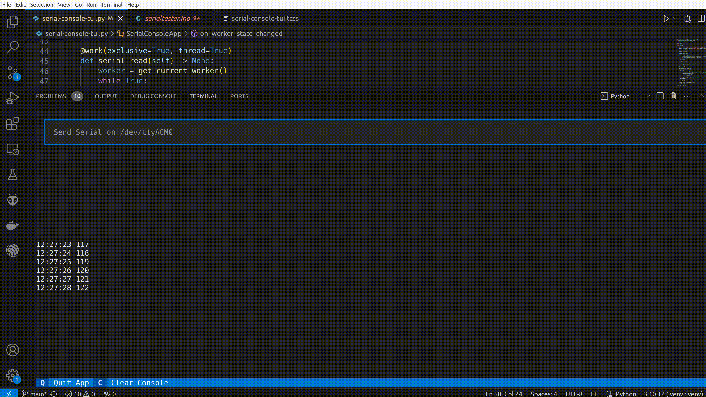

# serial-console-tui
A serial tui for reading and writing with textual.  
Its very basic and tries to mimic the Arduino serial console.  

# serialtester
Serialtester is a simple ardunio sketch to test/simulate the serial connection.   

- The Arduino/ESP32 sends every second a counter.  
- Sending an Integer to send Arduino/esp32, it sets the counter to it.  
